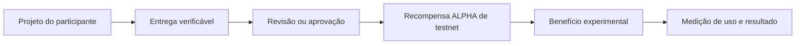

# ALPHA Lab

Projeto de segurança e experimentação em blockchain para desenvolver e validar um token utilitário ERC-20 em uma experiência de produto real.

O projeto entrega um token **ALPHA** de supply fixo, publicado na Base Sepolia, com foco em testar uma hipótese: usar recompensas e benefícios para ajudar desenvolvedores iniciantes a concluir e apresentar projetos de portfólio. A implementação prioriza invariantes verificáveis, limites explícitos e ausência de privilégios administrativos. A etapa atual é de descoberta e validação, não de venda ou investimento.

## Em 30 segundos

- **Entrega:** contrato ERC-20, testes, guardas de segurança, deploy local e deploy público em testnet.
- **Especialidade demonstrada:** modelagem de risco, segurança por restrição e experimentação de produto em blockchain.
- **Demo on-chain:** [ver contrato na BaseScan](https://sepolia.basescan.org/address/0xff15343aCcc4B77479EBE3C4cae32d99d4c60f48).
- **Rede:** Base Sepolia, Chain ID `84532`.
- **Stack:** Solidity `0.8.34`, Hardhat 3, OpenZeppelin Contracts, Hardhat Ignition e npm.
- **Status:** infraestrutura validada; utilidade do produto ainda em descoberta.

## O que foi entregue

| Resultado | Evidência |
|---|---|
| Token ERC-20 com supply fixo | `100.000.000 ALPHA`, mint único no construtor |
| Contrato público | [endereço verificado na Base Sepolia](https://sepolia.basescan.org/address/0xff15343aCcc4B77479EBE3C4cae32d99d4c60f48) |
| Validação de configuração | 18 invariantes de código/configuração aprovadas |
| Cobertura do contrato | 7 testes Solidity documentados |
| Reprodutibilidade | `npm ci`, build e deploy local via Hardhat |
| Limites de segurança | sem owner/admin, mint posterior, taxa, pause, proxy ou upgrade |

## Como funciona



O contrato registra a camada de token. A utilidade, a revisão de projetos e a medição do piloto ficam fora do contrato principal para manter o experimento simples e seguro.

## O que foi validado

- O bytecode foi publicado na Base Sepolia.
- `name = Alpha`, `symbol = ALPHA` e `decimals = 18` foram conferidos on-chain.
- O supply inicial foi confirmado no endereço do deployer.
- O código não possui mecanismos de emissão posterior, administração privilegiada ou upgrade.
- O guard de fonte cobre 18 invariantes e passa localmente.

## O que ainda falta

- Entrevistar 20 usuários potenciais.
- Publicar a landing page e a lista de espera.
- Construir a primeira utilidade fora do contrato.
- Executar o piloto com usuários ativos e medir ativação, retenção e custo.
- Validar receita independente da especulação do token.

Mainnet, venda pública, liquidez, staking e promessa de rendimento permanecem fora do escopo até que produto, segurança, conformidade e operação sejam comprovados.

## Executar localmente

Requisitos: Node.js `22.13.0` ou superior, npm e Git.

```bash
npm ci
npm run validate
```

Comandos individuais:

```bash
npm run guard
npm run build
npm test
npm run deploy:local
```

## Documentação

- [Desenho do token](docs/DESIGN.md)
- [Deploy e evidências da Base Sepolia](docs/BASE-SEPOLIA.md)
- [Hipótese de produto ALPHA Builders](docs/PRODUCT.md)
- [Roteiro de descoberta](docs/DISCOVERY.md)
- [Roadmap de validação](docs/ROADMAP.md)
- [Política de segurança](docs/SECURITY.md)

## Nota de responsabilidade

Este repositório é um laboratório técnico. ALPHA não está à venda e não constitui oferta, recomendação de investimento, consultoria jurídica ou garantia de retorno.
