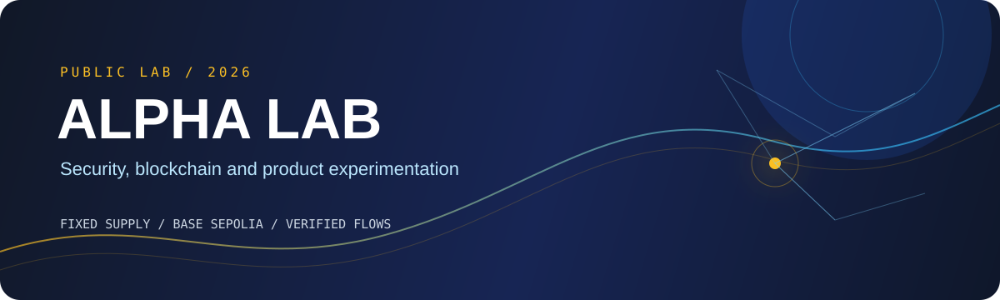
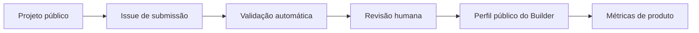

# ALPHA Lab

[](https://github.com/Kadys-dv/ALPHA-Lab/actions/workflows/solidity-validation.yml)
[](https://github.com/Kadys-dv/ALPHA-Lab/actions/workflows/frontend-ci.yml)
[](https://alpha-builders-web.cskadys.workers.dev)
[](https://sepolia.basescan.org/address/0xff15343aCcc4B77479EBE3C4cae32d99d4c60f48)

<p align="center">
  
</p>

Projeto de segurança e experimentação em blockchain para desenvolver e validar um token utilitário ERC-20 em uma experiência de produto real.

O ALPHA Lab entrega um token **ALPHA** de supply fixo e o **ALPHA Builders**, uma experiência pública para revisão e apresentação de projetos. A implementação combina Solidity, frontend web, automação e validações públicas, sem depender de venda ou especulação do token.

## Visão rápida

| | |
|---|---|
| **Demo** | [ALPHA Builders](https://alpha-builders-web.cskadys.workers.dev) |
| **Contrato** | [ALPHA na BaseScan](https://sepolia.basescan.org/address/0xff15343aCcc4B77479EBE3C4cae32d99d4c60f48) |
| **Foco** | Segurança por restrição, blockchain e experimentação de produto |
| **Stack** | Solidity, Hardhat 3, OpenZeppelin, Next.js, React, TypeScript, Base Sepolia e Cloudflare Workers |
| **Status** | Infraestrutura e experiência pública publicadas; validação de utilidade em andamento |

> Uma hipótese de produto, um contrato limitado e evidências públicas para cada etapa.

## Entregas verificáveis

| Resultado | Evidência |
|---|---|
| Token ERC-20 com supply fixo | `100.000.000 ALPHA`, mint único no construtor |
| Segurança do contrato | 18 invariantes de código/configuração e 7 testes Solidity |
| Deploy público | Base Sepolia, Chain ID `84532`, metadados e supply conferidos on-chain |
| Produto funcional | ALPHA Builders publicado no Cloudflare Workers |
| Fluxo de contribuição | Issues públicas, validação automática e aprovação humana |
| Qualidade frontend | lint, TypeScript, Vitest, Playwright, Axe e Lighthouse CI |
| Operação rastreável | endpoints de status/versão, SHA de commit e smoke de produção |

## Como funciona



O contrato registra a camada de token. A revisão, a evidência pública, os perfis e as métricas ficam no frontend e na automação para manter o contrato simples e o experimento observável.

## Segurança e limites

- supply fixo e mint único no construtor;
- sem owner/admin, mint posterior, taxa, blacklist, pause, proxy ou upgrade;
- sem compra, transferência financeira, `approve`, swap, bridge, staking ou integração com Base Mainnet;
- aprovação de contribuições sempre depende de revisão humana;
- chaves privadas nunca são versionadas ou usadas no frontend.

## O que foi validado

- bytecode publicado na Base Sepolia;
- `name = Alpha`, `symbol = ALPHA` e `decimals = 18` conferidos on-chain;
- supply inicial confirmado no deployer;
- build do frontend e bundle Cloudflare validados;
- testes de acessibilidade, navegador, SEO e performance configurados na CI;
- produção verifica o SHA implantado, a rede, o contrato e a ausência de CTAs financeiros proibidos.

## O que ainda falta

- entrevistar 20 usuários potenciais;
- medir submissões, aceitação, repetição de uso e custo operacional;
- validar a primeira utilidade fora do contrato;
- testar receita independente da especulação do token;
- cumprir os gates de produto, segurança, conformidade e operação antes de considerar mainnet.

## Executar localmente

Contrato:

```bash
npm ci
npm run validate
```

Frontend:

```bash
cd web
npm ci
npm run lint
npm run typecheck
npm test
npm run build
npm run dev
```

Para validar o bundle Cloudflare:

```bash
npm run build:vinext
```

## Documentação

- [Desenho do token](docs/DESIGN.md)
- [Deploy e evidências da Base Sepolia](docs/BASE-SEPOLIA.md)
- [Frontend e pipeline](docs/FRONTEND.md)
- [Cloudflare Workers](docs/CLOUDFLARE.md)
- [Produção](docs/PRODUCTION.md)
- [Métricas](docs/METRICS.md)
- [Hipótese de produto ALPHA Builders](docs/PRODUCT.md)
- [Roadmap de validação](docs/ROADMAP.md)
- [Política de segurança](docs/SECURITY.md)

## Nota de responsabilidade

Este repositório é um laboratório técnico. ALPHA não está à venda e não constitui oferta, recomendação de investimento, consultoria jurídica ou garantia de retorno.
